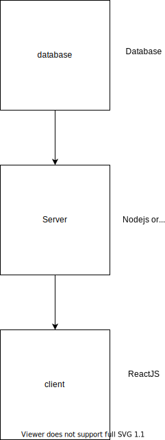

What is Plato?

Plato is an operations management solution designed to simplify orgnization and management of infrastructure resourcers that form a platform. Platform here can be a data platform or your entire backedn stack. Plato constructs allow you to organize you infra resources in a well defined top-down structure, track custom metrics at all levels of details, and be strategic in making improvements to your platform.

Detailed description

Plato is born out frustrations of infrastructure clutter that manifests when the speed of engineering execution is expected to match that of product feature ideation without initially spending enough time to ramp-up technical foundations. In reality, this looks like a bunch of compute instnce or clusters provisiond bu not used, a few lambda functions provisoned for POCs but really clear if they're still needed, unsure of which object storage containers are use case specific vs ony for testing purpose.

You may've noticed that when communicating a tech stack or a platform to sponsors/leadershop... the architecture is usually very neat and clean. Something like shown below:

In actual implementation, say on AWS or Azure, the neatness associated with clean boundaries and names of a diagram similar to above goes away. In most cases, details of how a box on a diagram translates to an actual infrastructure resource is part of tribal knowledge that resided in engineer's head or some long documentation. Usually, what you have for a UI is a list of compute resources that you've to sift through beofre you can confidently map a box on architecture diagram to an actual resource. Plato, at bare minimum, is this mapping og your architecture diagram to actual infrastructure resources in the cloud. So that you can just click on any resource and navigate to the resurce page. 

In addition to above, Plato offers a lot more goodies to simplify tech manager's life while ehancing their productivity. Checkout the full feature list here.

Who is the primary audience?

# Install

# Usage

# ToDo

# How to get involved